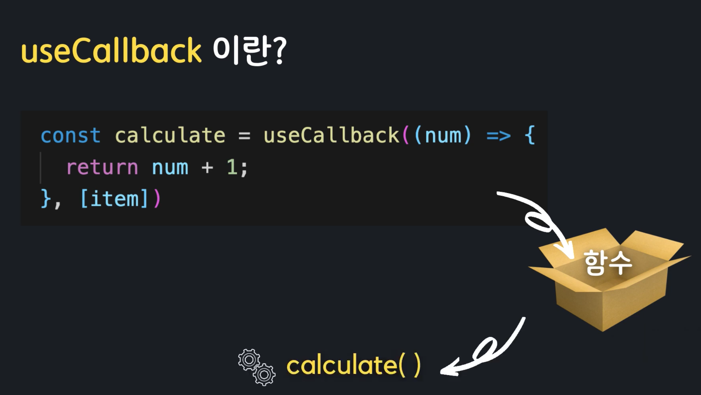

## 16. useEffect
    # 어떤 컴포넌트가 마운트 되었을때, 혹은 마운트 해제 되었을때, 특정작업을 처리할 코드를 실행시켜주고 싶을때 사용


[형태]
```
 useEffect(() => {
    //작업..
 }) 
 #인자로 콜백함수를 받음
```


#### *2가지의 형태가 있다

1.형태는 하나의 콜백함수를 인자로 받는 형태
- 렌더링 될때마다 실행

2.첫번째 인자로 콜백합수를 받고 두번째 인자로 배열(다른이름으로 디펜던시 어레이라고 함)을 받는 형태
- 화면에 첫 렌더링 될때 실행 또는 value(state) 값이 바귈때 실행
- 빈 배열을 전달시 맨처음 화면이 렌더링 될때 실행


## useEffect 내에서 언마운트시 clean up이 필요함
    # useEffect 내에서 리턴으로 함수를 반환하면 정리가 된다  

[형태]
```
useEffect(() => {   
    //작업...
      
    return () => {      
        //정리 작업     
    }   
})

ex)setInterval, clearInterval
```  

## 17. useMemo

    # 컴포넌트 최적화에 사용(자주 사용 되는 값을 캐싱(메모리에 저장)하여 캐시에서 필요할때만 꺼내다 씀)


#### *여러번 계산해야할 작업을 처음 한번의 작업결과를 저장후 필요할때마다 꺼내 사용


#### *렌더링은 함수형 컴포넌트가 호출되는것을 의미하며 그때마다 모든 내부 변수는 초기화 됨


#### *처음 계산된 결과값을 메모리에 저장하고 컴포넌트의 반복적으로 렌더링이 되어도 이전에 계산된 값을 메모리에서 꺼내와 재사용 함

[형태]
```
const value = useMemo(() => {   
    return calculator();
}, [])

```  
*콜백함수와 배열을 인자로 받음
1. 콜백함수는 memoise에 전해줄 값을 계산하여 리턴해주는 함수로 리턴된 값이 useMemo의 값이 됨
2. 의존성 배열인 두번쨰 인자는 배열의 요소의 값이 업데이트 될때만 콜백함수를 다시 호출하여 memoization 된 값에 업데이트하여 다시 memoization을 함
3. 빈 배열을 넘길시 컴포넌트가 마운트 될때만 값을 계산하고 이후에는 memoization된 값을 꺼내와서 사용

### [!주의!]
#### !!!무분별하게 사용시 오히려 성능에 무리가 갈 수 있으므로 필요할때만 적절히 사용하는것이 중요함 이유는 값을 재활용하기 위해 따로 메모리를 소비하여 저장하기 떄문에 불필요한 값까지 저장시 성능을 떨어뜨림

## 18. useCallback
    # useMemo와 같은 역할을 함  




[형태]
```
useCallback(() => {   
    return value;
}, [item])

```  
1. memoization 할 콜백함수를 인자로 받음
2. 의존성 배열을 받게되어 배열 내부 값이 변하지 않는 이상 다시 초기화 되지 않음

[javascript 함수 비교]
```
** calculate 함수 객체가 할당되어 있음

const calculate = (num) => {
    return num+1
}

** 아래의 형태로 useCallback으로 감싸게 되면 memozation되어 재사용이 가능

const calculate = useCallback((num) => {
    return num+1
},[item])
```

## 19. React.memo
    # 고차컴포넌트(HOC)이며 특정컴포넌트를 React.memo를 통해 Props의 변화를 체크하여 변화가 없을시 재사용하고 변화할때만 렌더링 하도록 최적화된 컴포넌트를 반환함
    # 부모 컴포넌트로 인한 자식 컴포넌트의 리랜더링되는 횟수를 제한하기 위해사용
    # 부모 컴포넌트에서 넘겨주는 Props의 값이 항상 같으면 굳이 같은 결과를 보여줄 필요가 없다. 
      따라서 자식컴포넌트의 Props가 바뀔때만 리렌더링 하도록 해준다.


*사용하기 적합한 상황
1. 컴포넌트가 같은 Props로 자주 렌더링 될때
2. 컴포넌트가 렌더링 될때마다 복잡한 로직을 처리해야할때

이외에 경우 굳이 React.memo가 필요한지 고민이 필요

### [!주의!]
#### 1. !!!useMemo와 같이 메모리를 사용하므로 적절한 사용이 필요함
#### 2. Props체크를 통해서만 렌더링이 될지 안될지 판단이 필요함. 상태와 관련된 useState, useReduce, useContext와 같은것을 사용하면 Props의 변화가 없더라도 리렌더링 될 수 있음

## 20. useReducer
    # useState처럼 state를 생성하고 관리할 수 있게 해주는 도구
    # dispatch Action reducer 세가지로 이루어짐
    # 여러개의 하위값을 포함하는 복잡한 스테이트를 다뤄야할떄 사용하며, 유지보수에도 좋음

[예시 그림]


[컴포넌트 관점]


## 참조
#### (유튜브 -별코딩)

- [useEffect](https://www.youtube.com/watch?v=kyodvzc5GHU)
- [useMemo](https://www.youtube.com/watch?v=e-CnI8Q5RY4)
- [useCallback](https://www.youtube.com/watch?v=XfUF9qLa3mU&t=0s)
- [React.memo](https://www.youtube.com/watch?v=oqUgcxwrnSY&t=501s)
- [useReducer](https://www.youtube.com/watch?v=tdORpiegLg0)
