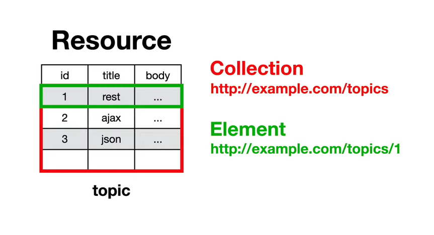
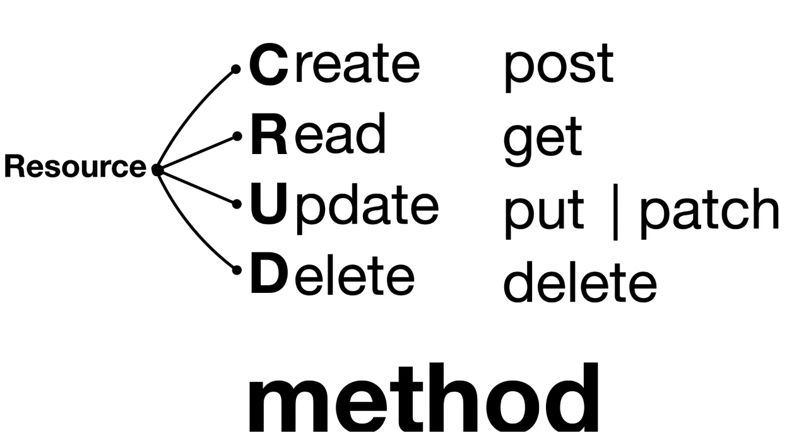

# REACT API 연동하기

## API 연동의 기본
### REST API

1. 통신 규칙 (웹 통신 규약 http를 사용)

    print, document.write 같은 하나하나가 api라고 할 수 있다.

```jsx
       print('hello world')
    
       document.write('hello world')
```

2. rest api도 컴퓨터의 기능을 실행시키는 명령어

    특정 URI를 통해 데이터를 가져와서 출력한다.
```jsx
        ex) google calendars
       https://www,googleapis.com/.../calendars/calendars_id
        {
            "summary" : "일정",
            "timeZone" : "Asia/Seoul"
        }
```

이런식으로 http를 사용하여 기계들끼리 통신하기 위한 방법으로 볼 수 있다.

[데이터 구조]


3. method

   이런 데이터를 가공을 하기 위해 아래 그림과 같은 4가지의 작업을 하게 되는데 이런 작업들을 method라 부른다


   [데이터 가공]
   
   
[실 습](http://localhost:3000)

