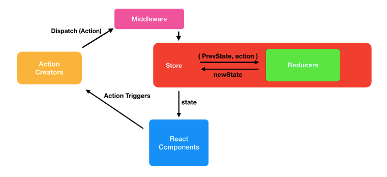

# 리덕스 미들웨어

## 미들웨어란?
- 운영체제와 응용 소프트웨어 중간에서 조정과 중개 의 역할을 수행
- 액션을 디스패치 했을 때 리듀서에서 이를 처리하기에 앞서 사전에 지정된 작업을 실행하는 액션과 리듀서의 중간자
- 리듀서가 액션을 처리하기 전에 미들웨어가 할 수 있는 작업은 여러가지가 있다. 전달받은 액션을 단순히 콘솔에 기록하거나,     
  전달받은 액션 정보를 기반으로 액션을 아예 취소하거나, 다른 종류의 액션을 추가로 디스패치



## 미들웨어를 쓰는 이유
- 리덕스는 액션이 발생하면 디스패치를 통해 스토어에게 상태 변화의 필요성을 알린다.  
 개발자는 가끔 디스 패치된 액션을 스토어로 전달하기 전에 로깅, 액션 취소, 다른 액션을 발생 시키는 등의 작업을 하고 싶을 수 있다.    
 미들웨어는 이러한 작업을 가능하게 해준다.
- 리덕스는 아래의 과정으로 동작한다.
```
액션 객체 생성 → 디스패치가 액션 발생을 스토어에게 알림 → 정해진 로직에 따라 리듀서가 액션 처리 → 리듀서가 새로운 상태값 반환 → 스토어가 새로운 상태를 저장

(이러한 작업은 동기적으로 동작한다.)
```
- 위 과정은 순식간에 실행된다. 때문에 위 과정을 시간을 딜레이 시켜 동작하게 하거나 ajax 통신 같은 비동기 작업을 넣을 수가 없다
```js ex) 액션 생성 함수 내에서 ajax요청을 하고 응답값을 payload에 넣어 액션 객체를 생성하여 반환한다고 하면 에러가 나거나 정상작동하지 않는다.
// async/await로 만든 액션 생성 함수
export const fetchData = async () => {
  //임의의 api 주소에 async await으로 (get) 요청을 하였다.
  const response = await APIadress.get('/data')
 
  return {
    type: 'FETCH_DATA',
    payload: response
  }
}
// 결과 : 아래 에러 발생
// action must be plain objects. Use custom middleware for async actions
// 이유 : reducer로 dispatch 되는 최초의 action 형태는 
//       plain object가 아니라 async await의 함수의 형태이기 때문

// Promise로 만든 액션 생성 함수
export const fetchData = async () => {
  //임의의 api 주소에 (get) 요청을 promise 형태로 하였다.
  const promise = await APIadress.get('/data')
 
  return {
    type: 'FETCH_DATA',
    payload: response
  }
}
// 결과 : 에러는 나지 않지만 정상 작동하지 않음
// 이유 : Promise를 사용하면 reducer에서 
//       '반환된 데이터가 아직 없다'(객체에 아무것도 없다!)라고 판단하기 때문
```
- 리덕스에서는 이러한 비동기 작업을 처리하기 위한 지침을 알려주지 않고 있기 때문에 이러한 비동기 작업을 처리하는 데 있어 리덕스 미들웨어를 주로 사용한다.


## 대표적인 redux middleware
- redux-logger : 액션 정보를 콘솔에 출력해주는 미들웨어.
- redux-thunk : 비동기 작업을 처리 할 때 가장 많이 사용하는 미들웨어. 객체가 아닌 함수 형태의 액션을 디스패치할 수 있게 해준다.
- redux-saga : redux-thunk 다음으로 가장 많이 사용되는 비동기 작업 관련 미들웨어 라이브러리.  
  특정 액션이 디스 패치 되었을 때 정해진 로직에 따라 다른 액션을 디스패치 시키는 규칙을 작성하여 비동기 작업을 처할 수 있게 해준다.

## 미들웨어 작동 방식
- 리덕스 미들웨어를 만들때 템플릿을 사용한다.
```js
// 미들웨어 기본 템플릿
const middleware = store => next => action => {
	// 처리 로직
};

// 일반 함수 형식
const middleware = function middleware(store) {
	return function(next) {
		return function(action) {
			// 처리 로직
		}
	}
}
```
- 미들웨어는 함수를 반환하는 함수를 반환하는 함수다.
- 함수의 첫 번째 매개변수인 `store는` 리덕스 스토어 인스턴스로, 이 안에 `dispatch`, `getState`, `subscribe` 내장함수들이 들어있다.
- 두 번째 매개변수인 `next`는 액션을 다음 미들웨어에게 전달하는 함수로 `store.dispatch`와 비슷한 역할을 한다.     
  `next(action)` 형태로 사용하며, `next(action)` 를 호출하면 그 다음 처리해야할 미들웨어에게 액션을 넘겨주고, 만약 미들웨어가 없다면 리듀서에게 액션을 넘겨준다.     
  만약 미들웨어 내부에서 `next`를 사용하지 않으면 액션이 리듀서에게 전달되지 않는다. 즉 액션이 무시되는 것이다.
- `action`은 디스패치되어 현재 처리하고 있는 액션을 가리킨다.
- 미들웨어 내부에서 `store.dispatch`를 사용하면 첫번째 미들웨어부터 다시 처리한다.

`[미들웨어 논리구조]` 


- 미들웨어는 위와 같은 구조로 작동한다. 리덕스 스토어에는 여러 개의 미들웨어를 등록할 수 있다.     
  새로운 액션이 디스패치 되면 첫 번째로 등록한 미들웨어가 호출된다.   
  만약에 미들웨어에서 next(action)을 호출하게 되면 다음 미들웨어로 액션이 넘어간다.   
  그리고 만약 미들웨어에서 store.dispatch 를 사용하면 다른 액션을 추가적으로 발생시킬 수 도 있다.

## logger 만들기 / redux-logger 사용

- 브라우저의 콘솔에서 상태변화를 확인하기 위해 사용(미들웨어의 작동방식을 확인 가능)


`[미들웨어 템플릿을 사용한 logger 사용하기]`

```js
// src/middlewares/myloggerMiddleware.js
// 이전상태, 액션정보, 새로워진 생태를 순차적으로 콘솔에 기록하는 미들웨서
const loggerMiddleware = store => next => action => {
    // 미들웨어 기본 구조
    console.group(action && action.type); // 액션 타입을 그룹명으로 설정
    console.log('이전상태', store.getState());
    console.log('action', action);
    next(action); // 다음 미들웨어 혹은 리듀서에게 전달
	// next 함수를 쓰지 않으면 리듀서에게 전달이 되지 않기 때문에 액션이 무시 됨
	// next 함수를 기준으로 이전이 이전 상태, 이후가 다음 상태
    console.log('다음 상태', store.getState());
    console.groupEnd(); // 그룹 끝
}

export default loggerMiddleware;

// src/index.js - 미들웨어 스토어에 적용
import React from 'react';
import ReactDOM from 'react-dom';
import { applyMiddleware, createStore } from 'redux';
import { Provider } from 'react-redux';
import './index.css';
import App from './App';
import rootReducer from './modules';
import loggerMiddleware from './lib/loggerMiddleware';

// 미들웨어는 스토어를 생성하는 과정에서 applyMiddleware() 함수를 사용하여 적용한다.
const store = createStore(rootReducer, applyMiddleware(loggerMiddleware));

ReactDOM.render(
  <Provider store={store}>
    <App />
  </Provider>,
  document.getElementById('root')
);
```

`[redux logger 사용하기]`

- 설치 : `npm i redux-logger`
- `src/index.js`에 적용

```js
import React from 'react';
import ReactDOM from 'react-dom';
import { applyMiddleware, createStore } from 'redux';
import { Provider } from 'react-redux';
import './index.css';
import App from './App';
import rootReducer from './modules';
// import loggerMiddleware from './lib/loggerMiddleware';
import { createLogger } from 'redux-logger';
//import logger from 'redux-logger'; 따로 createLogger(); 사용 필요없이 작명하여 사용 가능

const logger = createLogger(); //생략 가능,작명한 변수명으로 사용 
const store = createStore(rootReducer, applyMiddleware(logger));

ReactDOM.render(
  <Provider store={store}>
    <App />
  </Provider>,
  document.getElementById('root')
);
```

## redux-thunk

- 리덕스를 사용하는 프로젝트에서 비동기 작업을 처리할 때 가장 기본적으로 사용하는 미들웨어.    
  리덕스의 창시자인 댄 아브라모프가 만들었으며, 리덕스 공식 메뉴얼에서도 이 미들웨어를 사용하여 비동기 작업을 다루는 예시를 보여준다.

```js
//src/index.js
import React from 'react';
import ReactDOM from 'react-dom/client';
import './index.css';
import App from './App';
import reportWebVitals from './reportWebVitals';
import { createStore, applyMiddleware } from 'redux';
import { Provider } from 'react-redux';
import rootReducer from './modules';
import myLogger from './middlewares/myLogger';
import logger from 'redux-logger';
import {composeWithDevTools} from "redux-devtools-extension";
import ReduxThunk from 'redux-thunk';
import { BrowserRouter } from 'react-router-dom';

// 미들웨어는 스토어를 생성하는 과정에서 myLogger() 함수를 사용하여 적용한다.
// logger 를 사용하는 경우, logger가 가장 마지막에 와야합니다.
// const store = createStore(rootReducer, applyMiddleware(myLogger, logger)); // 여러개의 미들웨어를 적용 할 수 있습니다.
const store = createStore(rootReducer, composeWithDevTools(applyMiddleware(ReduxThunk, myLogger, logger))); // 여러개의 미들웨어를 적용 할 수 있습니다.

const root = ReactDOM.createRoot(document.getElementById('root'));
root.render(
    // <BrowserRouter>
    <Provider store={store}>
        <App />
    </Provider>
    // </BrowserRouter>,
);

// If you want to start measuring performance in your app, pass a function
// to log results (for example: reportWebVitals(console.log))
// or send to an analytics endpoint. Learn more: https://bit.ly/CRA-vitals
reportWebVitals();


//modules/counter.js
// 액션 타입
const INCREASE = 'INCREASE';
const DECREASE = 'DECREASE';

// 액션 생성 함수
export const increase = () => ({ type: INCREASE });
export const decrease = () => ({ type: DECREASE });

// getState를 쓰지 않는다면 굳이 파라미터로 받아올 필요 없습니다.
export const increaseAsync = () => dispatch => {
    setTimeout(() => dispatch(increase()), 1000);
};
export const decreaseAsync = () => dispatch => {
    setTimeout(() => dispatch(decrease()), 1000);
};

// 초깃값 (상태가 객체가 아니라 그냥 숫자여도 상관 없습니다.)
const initialState = 0;

export default function counter(state = initialState, action) {
    switch (action.type) {
        case INCREASE:
            return state + 1;
        case DECREASE:
            return state - 1;
        default:
            return state;
    }
}
```


